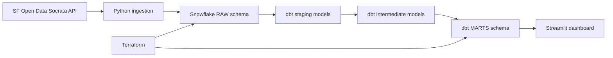

# SF City Pulse - Unified Data Platform POC

> A portfolio proof-of-concept inspired by DataSF's Unified Data Platform work.
> It asks: are San Francisco neighborhoods with high construction activity also
> generating disproportionate 311 complaints, and are response times equitable
> across supervisor districts?
Live app - https://sf-city-pulse.streamlit.app/

## Architecture



## Stack

Snowflake, dbt Core, Terraform, Python, Streamlit, Plotly, SF Open Data.

## Data Sources

- 311 Service Requests: `https://data.sfgov.org/resource/vw6y-z8j6.json`
- Building Permits: `https://data.sfgov.org/resource/i98e-djp9.json`

Both ingestion scripts pull the most recent two years of data and do a truncate
plus reload into Snowflake RAW tables for an idempotent POC workflow.
The 311 API's current neighborhood field is `neighborhoods_sffind_boundaries`;
the ingestion layer aliases it to `neighborhood` so the warehouse model stays
business-readable.
The ingestion jobs stream paginated API batches into Snowflake, so the project
can load the full two-year source window without holding the entire dataset in
local memory.

## Repository Layout

```text
terraform/        Snowflake database, schemas, warehouse, role, and dbt user
ingestion/        Socrata API ingestion into Snowflake RAW tables
dbt_sf_udp/       dbt project: staging, intermediate, marts, tests, macros
dashboard/        Streamlit dashboard over the mart model
scripts/          Local operational helpers, including SQL provisioning fallback
.env.example      Local environment template
requirements.txt  Python dependencies
```

## Setup

Create a Python environment:

```powershell
python -m venv .venv
.\.venv\Scripts\Activate.ps1
pip install -r requirements.txt
```

Copy the environment template:

```powershell
Copy-Item .env.example .env
```

Fill in `.env` with your Snowflake and optional Socrata app token values.

## Provision Snowflake

Terraform accepts credentials through `TF_VAR_*` environment variables. In
PowerShell:

```powershell
$env:TF_VAR_snowflake_organization_name = "YOUR_ORG"
$env:TF_VAR_snowflake_account_name = "YOUR_ACCOUNT"
$env:TF_VAR_snowflake_user = "YOUR_ADMIN_USER"
$env:TF_VAR_snowflake_password = "YOUR_ADMIN_PASSWORD"
$env:TF_VAR_dbt_user_password = "CHANGE_ME_STRONG_PASSWORD"
```

You can also copy `terraform\terraform.tfvars.example` to
`terraform\terraform.tfvars` for a local-only workflow; it is gitignored.

Run:

```powershell
terraform -chdir=terraform init
terraform -chdir=terraform plan
terraform -chdir=terraform apply
```

Terraform creates:

- Database: `SF_UDP_POC`
- Schemas: `RAW`, `STAGING`, `MARTS`
- Warehouse: `TRANSFORM_WH`, X-Small, auto-suspend after 60 seconds
- Role: `TRANSFORMER`
- User: `DBT_USER`, granted the `TRANSFORMER` role

This POC provisions `DBT_USER` as a legacy service user so password-based dbt
and Python connector flows work cleanly. For production, replace that with
key-pair authentication and avoid keeping passwords in Terraform state.
The Terraform provider uses Snowflake's current `snowflakedb/snowflake`
namespace and pins the first officially supported v2 release for repeatable
local validation.

If a local machine blocks Terraform provider plugin execution, the equivalent
development provisioning path is:

```powershell
.\.venv\Scripts\dotenv.exe -f .env run -- .\.venv\Scripts\python.exe scripts\provision_snowflake_sql.py
```

## Ingest Raw Data

```powershell
python -m ingestion.run_pipeline
```

You can also run the source-specific scripts independently:
`python ingestion\ingest_311.py` and `python ingestion\ingest_permits.py`.

The scripts create and reload:

- `SF_UDP_POC.RAW.RAW_311_REQUESTS`
- `SF_UDP_POC.RAW.RAW_BUILDING_PERMITS`

## Run dbt

Use the committed dbt profile, which reads credentials from environment
variables:

```powershell
$env:DBT_PROFILES_DIR = "$PWD\dbt_sf_udp"
dbt run --project-dir dbt_sf_udp
dbt test --project-dir dbt_sf_udp
dbt docs generate --project-dir dbt_sf_udp
```

The final dashboard table is:

```text
SF_UDP_POC.MARTS.MART_NEIGHBORHOOD_EQUITY
```

## Launch Dashboard

```powershell
streamlit run dashboard\app.py
```

The dashboard has four tabs:

- City Overview: KPI cards, monthly activity trends, top 311 neighborhoods,
  and slow-response neighborhood detail
- District Equity: response-time index, city-versus-district trend comparison,
  and district-level open request shares
- Construction vs Complaints: permit volume, estimated construction value, and
  permit-to-complaint ratios by neighborhood
- Neighborhood Drilldown: selected-neighborhood monthly profile and
  district-level breakdown

## Key Findings

Based on the full two-year POC load:

- 1,688,799 raw 311 requests and 51,099 raw permit records were loaded.
- 1,661,695 cleaned 311 requests and 18,698 active building permits were modeled.
- The citywide average 311 closure time is 9.38 days; no supervisor district
  is above 2x that city average.
- District 7 has the highest average closure time among valid districts at
  13.55 days, followed by District 10 at 10.79 days and District 8 at 10.38
  days.
- Among neighborhoods with at least 500 closed 311 requests, Golden Gate Park
  has the slowest average closure time at 29.27 days.
- Seacliff has the highest construction-to-complaint ratio in the POC mart
  among neighborhoods with at least 100 requests: 157 permits against 1,376
  311 requests, a ratio of 0.114.

## Interview Talking Points

- Mirrors DataSF's stated Unified Data Platform direction with real SF datasets.
- Uses Terraform for Snowflake account objects, not just ad hoc SQL setup.
- Keeps transformation logic in dbt with tests and generated docs.
- Frames the analysis around equity, response times, and district-level service
  patterns rather than only producing charts.
